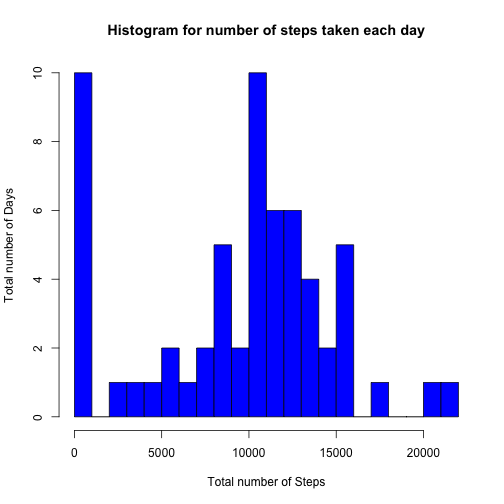
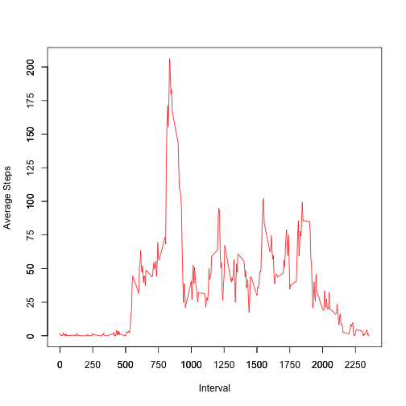
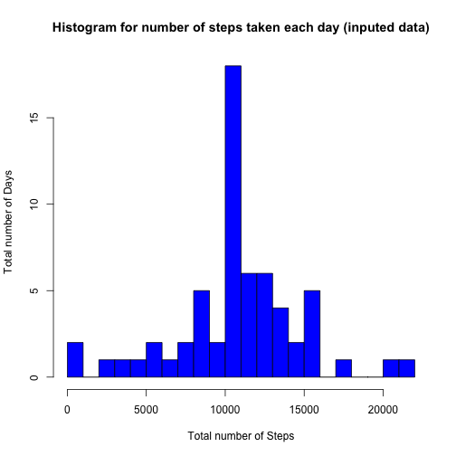

#Peer Assignment 1
##1. Introduction
It is now possible to collect a large amount of data about personal movement using activity monitoring devices such as Fitbut, Nike Fuelband, or Jawbone Up. These type of devices are part of the "quantified self" movement - a group of enthusiasts who take measurements about themselves regularly to improve their health, to find patterns in their behavior, or because they are tech geeks. But these data remain under-utilized both because the raw data are hard to obtain and there is a lack of statistical methods and software for processing and interpreting the data.

##2. Codebook
This assignment makes use of data from a personal activity monitoring device. This device collects data at 5 minute intervals dthrough out the day. The data consists of two months of data from an anonymous individual collected during the months of October and November, 2012 and include the number of steps taken in 5 minute intervals each day. 

The following details are important to consider:

- The Dataset [link nog toevoegen]

The variables included in this dataset are:

- **steps**: Number of steps taken in a 5-minute interval (missing values are coded as `NA`)

- **date**: The date on which the measurement was taken in YYYY-MM-DD format

- **interval**: Identifier for the 5-minute interval in which measurement was taken

- **time**: Starting time for the measurement of the step count

The dataset is stored in a comma-seperated-value (CSV) file and there are a total of 17,568 observations in the original dataset.

##3. Loading and preprocessing the data
1. Loading the data

```r
data <- read.csv("./activity.csv")
data$steps <- as.numeric(data$steps)
```

2. Process/ transform data

The code below transforms the interval column into a human and computer readable time in format `HH:MM`, and adds the column to the dataset called `time`.

```r
time <- data$interval
time2 <- mapply(function(x,y) paste0(rep(x,y), collapse=""), 0, 4-nchar(time))
time <- paste0(time2, time)
data$time <- format(strptime(time, format="%H%M"), format="%H:%M")
```

##4. What is the mean total of steps taken per day?
*Note*: missing values are ignored in this step

1. Calculation of the total number of steps taken per day

```r
sumDay <- aggregate(data$steps, list(data$date), FUN=sum, na.rm=TRUE)
sumDay_table <- data.frame(as.integer(sumDay[,2]), sumDay[,1])
```

2. Histogram of the total number of steps taken each day

```r
hist(sumDay_table[,1], main="Histogram for number of steps taken each day", xlab="Total number of Steps", ylab="Total number of Days",col="blue", breaks=30)
```

 

3. Calculation and report mean and median of the total number of steps per day

Here I will use an inline version of reporting R code.

```r
mean <- mean(sumDay$x)
median <- median(sumDay$x)
```

The mean number of steps per day is **9354.2295082**. The median number of steps per day is **1.0395 &times; 10<sup>4</sup>**.

## 5. The average daily activity pattern
1. Time series plot of the 5-minute interval (x-axis) and the average number of steps taken, averaged across all days (y-axis).

```r
sumInterval <- aggregate(data$steps, list(data$interval), FUN=mean, na.rm=TRUE)
names(sumInterval) <- c("interval", "mean_steps")
plot(sumInterval$interval, sumInterval$mean_steps, type="l", col="red", xlab="Interval", ylab="Average Steps")
axis(side=1, at=seq(0, 2400, by=250))
axis(side=2, at=seq(0, 210, by=25))
```

 


2. The 5-minute interval, on average across all days in the dataset, with the maximum number of steps. 

```r
index <- which(sumInterval$mean_steps == max(sumInterval$mean_steps))
interval <- sumInterval[index,][1]
```

The 5-minute interval, with the highest average number of steps across all days is: **835**.

## 6. Inputing missing values
1. Calculate and repot of total number of missing data in the dataset
The following formula gives a table of the number of missing values. *False* are the fields without missing vales. *True* are the fields with missing data. 


```r
no_NA <- table(is.na(data$steps))[1]
yes_NA <- table(is.na(data$steps))[2]
```

Thus, in this dataset there are **15264** fields with an actual value. In other words, these are not missing. In total there are **2304** missing values in the dataset. 

2. Devise a strategy for filling in all the missing value in the dataset.

A possible strategy to inpute the missing values is to take the average on the interval level and replace any missing value with this average. The following code would do this: 


```r
missing <- is.na(data$steps)
data_missing <- data[missing,]

for(i in 1:length(data_missing[,1])){
  data_missing[i,1] <-sumInterval[which(sumInterval$interval==data_missing[i,3]),2]
}
```

3. Create a new dataset that is equal to the original dataset with the missing data filled in. 

In this case the values that had missing, `data[missing,]` will be replaced with the new values of the `NA`s replaced with the mean values for that interval value:

```r
data_inputed <- data
data_inputed[missing,] <- data_missing
```

The following validation shows that there are **no NA values left**:

```r
table(is.na(data_inputed))
```

```
## 
## FALSE 
## 70272
```

4. Make a histogram of the total number of steps taken each day and Calculate and report the **mean** and **median** total number of steps taken per day. To these values differ from the estimates from the first part of the assignment? What is the impact of inputing missing data on the estimates of the total daily number of steps?

```r
sumDay_inputed <- aggregate(data_inputed$steps, list(data_inputed$date), FUN=sum, na.rm=TRUE)
sumDay_inputed_table <- data.frame(as.integer(sumDay_inputed[,2]), sumDay_inputed[,1])
```

The histogram below shows great difference with the first histogram. Most remarkable is that many days have moved from the left side of the x-axis, *<10.000* steps per day, to the the right side of the x-axis *>10.000* steps per day. 


```r
hist(sumDay_inputed_table[,1], main="Histogram for number of steps taken each day (inputed data)", xlab="Total number of Steps", ylab="Total number of Days",col="blue", breaks=30)
```

 


```r
mean_inputed <- mean(sumDay_inputed$x)
median_inputed <- median(sumDay_inputed$x)

difference_mean <- floor(mean_inputed-mean)
difference_median <- floor(median_inputed-median)
```

The mean number of steps per day in the new situation is **1.0766189 &times; 10<sup>4</sup>**. The median number of steps per day in the new situation is **1.0766189 &times; 10<sup>4</sup>**.

The difference in the mean therefore becomes: **1411**. In other words, with the inputed dataset there are on average **1411** more taken per day. 

The difference in the median becomes: **371**. 

In conclusion there is a large inpact by replacing the NA values with averages. Therefore, one might have to thread carefully to not influence the dataset too much. First step is to report on the fact that a replacement strategy has been implemented, so that the reader can take the actions of the researcher into account. 

## 7. Are there differences in activity patterns between weekdays and weekends?

The code below formats the dates in data to a format that is readable for R to use the `weekdays()` function on. 


```r
#create a new dataset to be sure
data_time <- data
#for(i in 1:length(data_time[,2])){
#  data_time[i,2] <- as.Date(data_time[i,2])
  
#}
```

I did not manage to get the final part of the assignment. 
